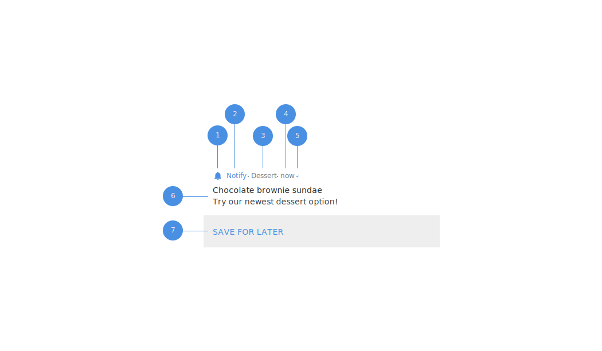

## Notify
Simplified notification delivery for Android.

[](http://kotlinlang.org)
[](https://github.com/ReactiveX/RxJava/releases/tag/v2.1.10)
[](https://travis-ci.org/Karn/notify)
[](https://codecov.io/gh/Karn/notify)
[
](./../../releases)


#### GETTING STARTED
Notify (pre-)releases are available via JitPack. It is recommended that  a specific release version is selected when using the library in production as there may be breaking changes at anytime.

> **Tip:** Test out the canary channel to try out features by using the latest develop snapshot; `develop-SNAPSHOT`.

``` Groovy
// Project level build.gradle
// ...
repositories {
    maven { url 'https://jitpack.io' }
}
// ...

// Module level build.gradle
dependencies {
    // Replace version with release version, e.g. 1.0.0-alpha, -SNAPSHOT
    implementation "io.karn:notify:[VERSION]"
}
```


#### USAGE
The most basic case is as follows:

```Kotlin
Notify
    .with(context)
    .content { // this: Payload.Content.Default
        title = "New dessert menu"
        text = "The Cheesecake Factory has a new dessert for you to try!"
    }
    .show()
```


If you run into a case in which the library does not provide the requisite builder functions you can get the `NotificationCompat.Builder` object and continue to use it as you would normally by calling `NotifyCreator#asBuilder()`.

> **Tip:** You can view other notification styles on the [Notification Types](./docs/types.md) docs page.

> **Tip:** Advanced usage topics are documented [here](./docs/advanced.md).

#### NOTIFICATION ANATOMY



| ID   | Name         | Description                                                                                             |
| ---- | ------------ | ------------------------------------------------------------------------------------------------------- |
| 1    | Icon         | Set using the `Header#icon` field.                                                                      |
| 2    | App Name     | Application name, immutable.                                                                            |
| 3    | Header Text  | Optional description text. Set using the `Header#headerText` field.                                     |
| 4    | Timestamp    | Timestamp of the notification.                                                                          |
| 5    | Expand Icon  | Indicates that the notification is expandable.                                                          |
| 6    | Content      | The "meat" of the notification set using of of the `NotifyCreator#as[Type]((Type) -> Unit)` scoped functions. |
| 7    | Actions      | Set using the `NotifyCreator#actions((ArrayList<Action>) -> Unit)` scoped function.                           |

#### CONTRIBUTING
There are many ways to [contribute](./.github/CONTRIBUTING.md), you can
- submit bugs,
- help track issues,
- review code changes.
