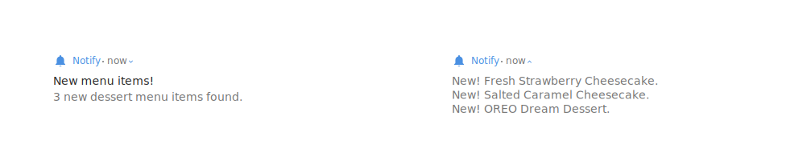
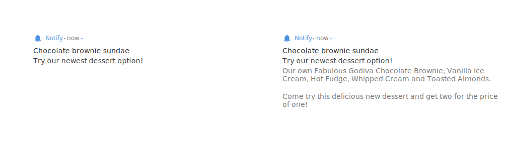
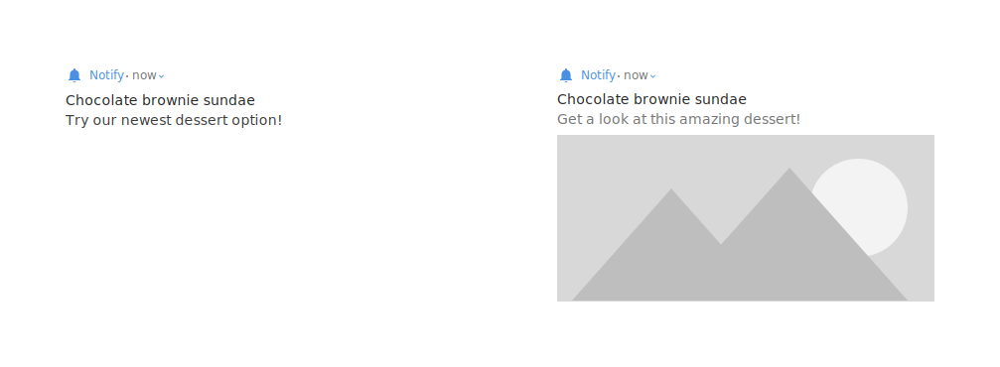
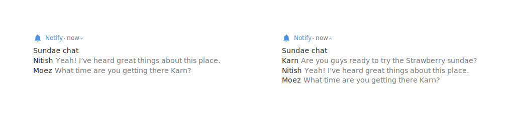
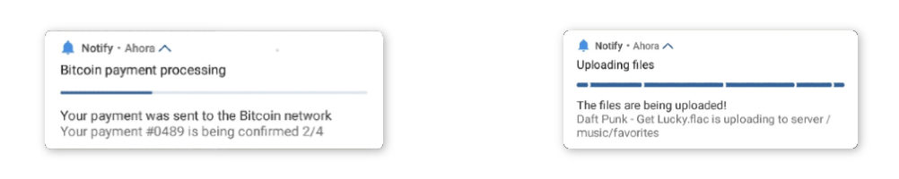

## Notification Types

#### STANDARD NOTIFICATION


Simple notifications are very easy!

```Kotlin
Notify
    .with(context)
    .content { // this: Payload.Content.Default
        // The title of the notification (first line).
        title = "New dessert menu"
        // The second line of the notification.
        text = "The Cheesecake Factory has a new dessert for you to try!"
    }
    .show()
```

#### LIST NOTIFICATION



Notifications with multiple lines are very common. Notify provides a simple DSL to build these notfications.

```Kotlin
Notify
    .with(context)
    .asTextList { // this: Payload.Content.TextList
        // The lines that are shown when the notification is expanded.
        lines = Arrays.asList("New! Fresh Strawberry Cheesecake.",
                              "New! Salted Caramel Cheesecake.",
                              "New! OREO Dream Dessert.")
        // The title of the collapsed notification.
        title = "New menu items!"
        // The second line of the collapsed notification.
        text = lines.size.toString() + " new dessert menu items found."
    }
    .show()
```

#### BIG TEXT



For instances where you'd like to show a longer message you can use the `BigText` notification type. These kinds of messages are ideal for things such as email content, and news previews.

```Kotlin
Notify
    .with(context)
    .asBigText { // this: Payload.Content.BigText
        // The title of the notification.
        title = "Chocolate brownie sundae"
        // The second line of the (collapsed) notification.
        text = "Try our newest dessert option!"
        // The second line of the expanded notification.
        expandedText = "Try our newest dessert option!"
        // Large string that is displayed under the line above.
        bigText = "Our own Fabulous Godiva Chocolate Brownie, Vanilla " +
                  "Ice Cream, Hot Fudge, Whipped Cream and Toasted " + 
                  "Almonds.\n\n" +
                  "Come try this delicious new dessert and get two for " +
                  "the price of one!"
    }
    .show()
```

#### BIG PICTURE



The big picture allows an application to notify the user in a manner similar to the [screenshot saved](https://www.androidexplained.com/wp-content/uploads/2017/10/Pixel-2-Screenshot-Notification.png) notification which shows a preview of the screenshot within the main content of the notification.

```Kotlin
Notify
    .with(context)
    .asBigPicture { // this: Payload.Content.BigPicture
        // The title of the notification.
        title = "Chocolate brownie sundae"
        // The second line of the (collapsed) notification.
        text = "Get a look at this amazing dessert!"
        // The second line of the expanded notification.
        expandedText = "The delicious brownie sundae now available."
        // A bitmap that is to be shown. The system will automatically resize
        // the image.
        image = BitmapFactory.decodeResource(context.resources,
                                             R.drawable.chocolate_brownie_sundae)
    }
    .show()
```

#### MESSAGE NOTIFICATION



The message notification is useful when displaying conversations within an application. It can also be useful to set the `headerText` field of the `Header` block with the number of messages outside the scope (list.size - 6).

```Kotlin
Notify
    .with(context)
    .asMessage { // this: Payload.Content.Message
        userDisplayName = "Karn"
        conversationTitle = "Sundae chat"
        messages = Arrays.asList(
                       NotificationCompat.MessagingStyle.Message(
                           "Are you guys ready to try the Strawberry sundae?",
                           System.currentTimeMillis() - (6 * 60 * 1000), // 6 Mins ago
                           "Karn"),
                       NotificationCompat.MessagingStyle.Message(
                           "Yeah! I've heard great things about this place.",
                           System.currentTimeMillis() - (5 * 60 * 1000), // 5 Mins ago
                           "Nitish"),
                       NotificationCompat.MessagingStyle.Message("What time are you getting there Karn?",
                           System.currentTimeMillis() - (1 * 60 * 1000), // 1 Mins ago
                           "Moez")
                    )
    }
    .show()
```

#### PROGRESS NOTIFICATION



Progress notification is useful when you need to display information about the detail of a process such as uploading a file to a server, or some calculation that takes time and you want to keep the user informed. You can ser `showProgress` true to display it, and if you need determinate progress you can set `enablePercentage` true and specify `progressPercent` to your current value

```Kotlin
Notify
    .with(context)
    .asBigText  {
        title = "Uploading files"
        expandedText = "The files are being uploaded!"
        bigText = "Daft Punk - Get Lucky.flac is uploading to server /music/favorites"
    }
    .progress {
        showProgress = true
        
        //For determinate progress
        //enablePercentage = true
        //progressPercent = 27
    }
    .show()
```
